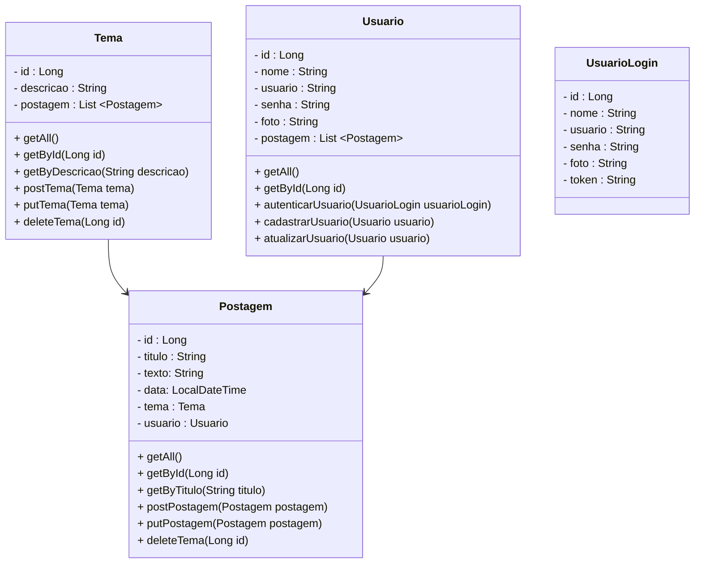

# Projeto Blog Pessoal (Em desenvolvimento)

 

     

  

## Diagrama de Classes

  

# Referências sobre Golang

 

<a href="https://go.dev/" target="_blank">Site Oficial - Golang</a>

<a href="https://go.dev/doc/" target="_blank">Documentação Oficial - Golang</a>

<a href="https://pkg.go.dev/" target="_blank">Repositório de pacotes Oficial - Golang</a>

<a href="https://gorm.io/" target="_blank">Biblioteca GORM - Mapeamento Objeto Relacional - Golang</a>

<a href="https://github.com/spf13/viper" target="_blank">Pacote Viper - Gerenciador de configurações da API - Golang</a>

<a href="https://pkg.go.dev/encoding/json" target="_blank">Pacote JSON - Golang</a>

<a href="https://github.com/gorilla/mux" target="_blank">Pacote MUX - Rotas e Endpoints - Golang</a>

<a href="https://github.com/go-playground/validator" target="_blank">Go Validator V10 - Validação de dados - Golang</a>

<a href="https://github.com/swaggo/swag" target="_blank">Swag - Documentação com o Swagger 2.0 - Golang</a>
